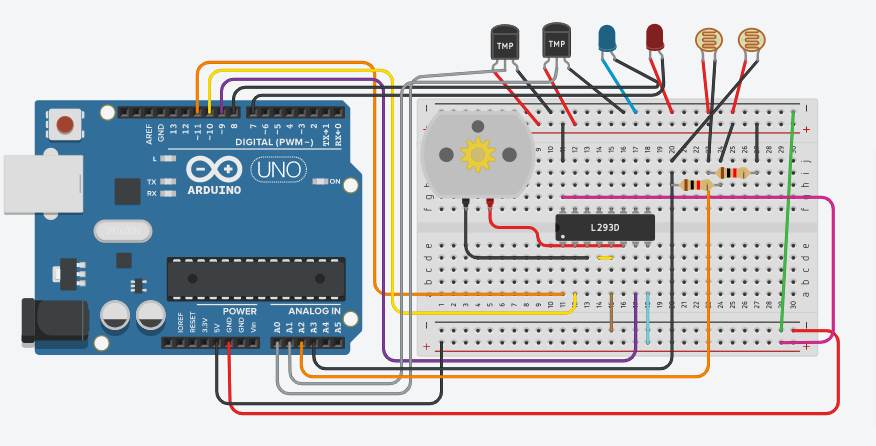

# DC MOTOR PROJECT

## Components
| Name | Quantity | Component |
| ----------- | ----------- | ----------- |
| U1 | 1 | Arduino Uno R3 |
| M1 | 1 | DC Motor |
| U2 | 1 | H-Brige Motor Driver |
| U3 , U5 | 2 | Temperature Sensor [TMP36] |
| D2 | 1 | Blue LED |
| D3 | 1 | Red LED |
| R1 , R2 | 2 | Photoresistor |
| R3 , R4 | 2 | 1 k-ohm Resistor |

## Preview
#### Before, run the program :

## Project Code
Click here, [DC Motor Project Code Link](dc-motor.ino)

## Tinkercad Link
Click here, [DC Motor Tinkercad Project Link](https://www.tinkercad.com/things/esYL3vM5kG6-copy-of-alternative-quizno1173-15-10419/editel?tenant=circuits)