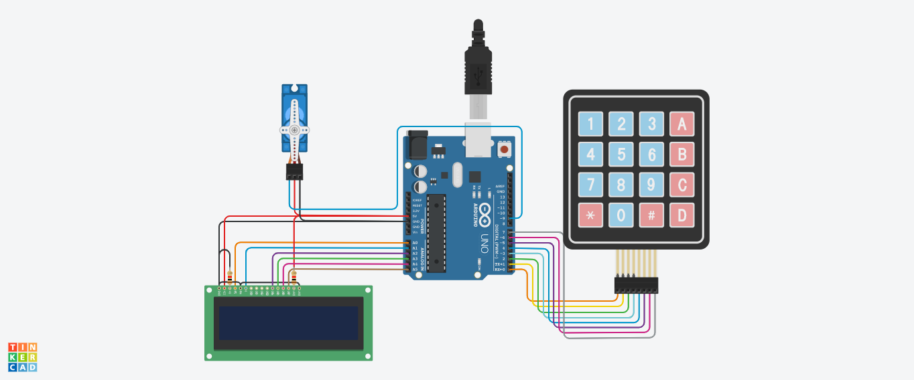
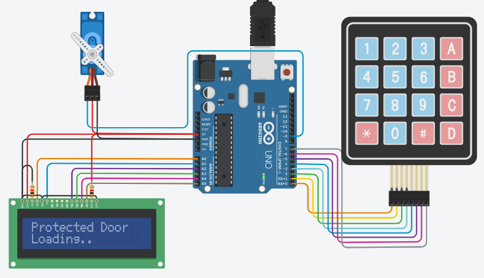
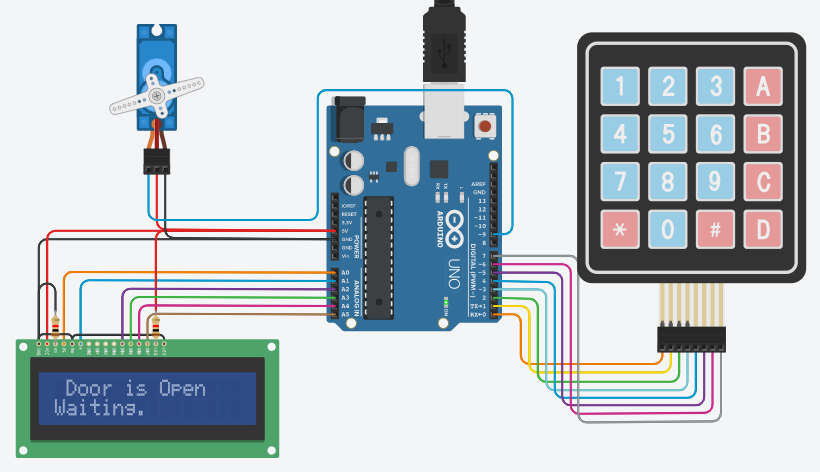
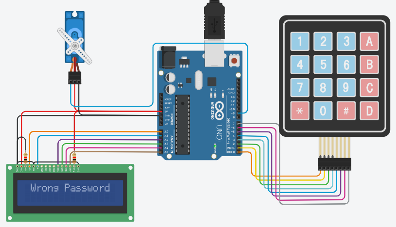

# DOOR PASSWORD SYSTEM PROJECT

## Components
| Name | Quantity | Component |
| ----------- | ----------- | ----------- |
| U2 | 1 | Arduino Uno R3 |
| U3 | 1 | LCD 16*2 |
| R1,R2 | 2 | 1 k-ohm Resistor |
| KEYPAD1 | 1 | Keypad 4*4 |
| SERVO1 | 1 | Positional Micro Servo |

## Preview
#### Before, run the program :

#### After, run the program :

## Project Code
Click here, [Door Password System Project Code Link](door-password-system.ino)

## Tinkercad Link
Click here, [Door Password System Tinkercad Project Link](https://www.tinkercad.com/things/8FVWXETrmiI-door-password-systemruhul-amin-parvez-173-15-10419/editel)