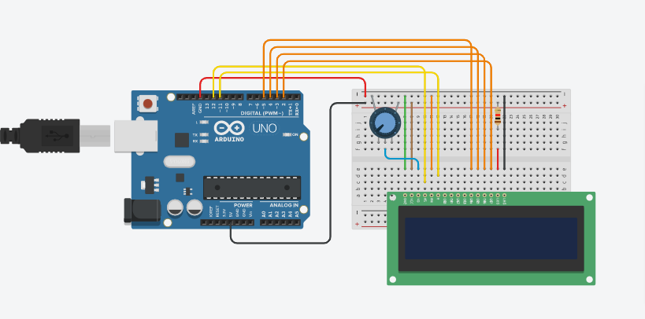
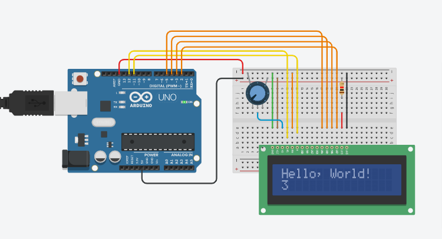

# LCD PROJECT

## Components
| Name | Quantity | Component |
| ----------- | ----------- | ----------- |
| U1 | 1 | Arduino Uno R3 |
| U2 | 1 | LCD 16 * 2 |
| Rpot1 | 1 | 250 k-ohm Potentiometer |
| R1 | 1 | 1 k-ohm Resistor |

## Preview
#### Before, run the program :

#### After, run the program :

## Project Code
Click here, [LCD Project Code Link](lcd.ino)

## Tinkercad Link
Click here, [LCD Tinkercad Project Link](https://www.tinkercad.com/things/ewRSrQoujAy-copy-of-no3-ruhulaminparvez-173-15-10419/editel?tenant=circuits)