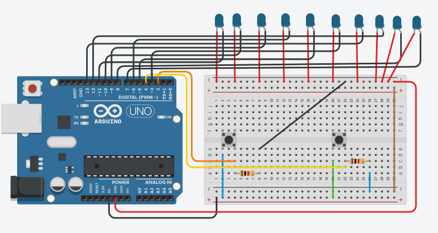
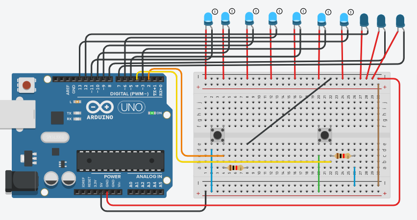

# LED PROJECT

## Components
| Name | Quantity | Component |
| ----------- | ----------- | ----------- |
| U1 | 1 | Arduino Uno R3 |
| S1, S2 | 2 | Pushbutton |
| R1, R2 | 2 | 1 k-ohm Resistor |
| D1, D2, D3, D4, D5, D6, D7, D8, D9, D10 | 10 | Blue LED |

## Preview
#### Before, run the program :

#### After, run the program :

## Project Code
Click here, [LED Project Code Link](led.ino)

## Tinkercad Link
Click here, [LED Tinkercad Project Link](https://www.tinkercad.com/things/dU5LwVeUBcD-copy-of-alternative-quizno2173-15-10419/editel?tenant=circuits)