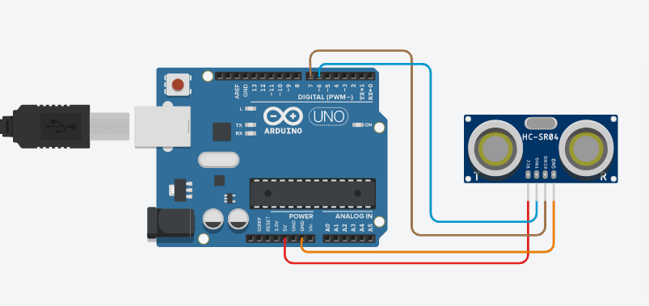
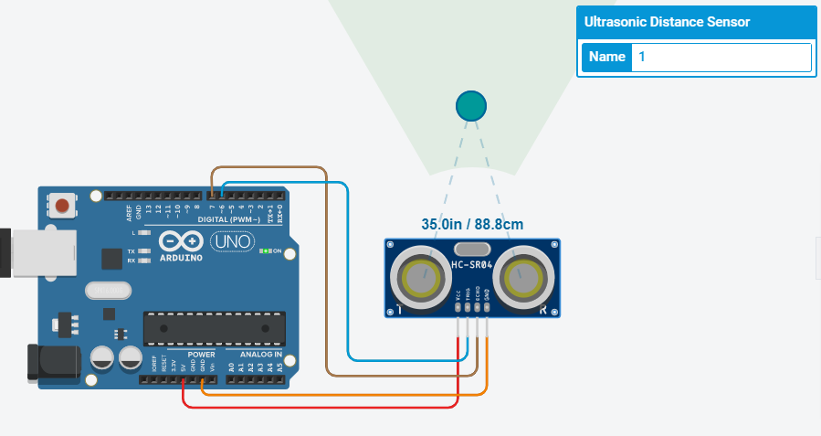

# ULTRASONIC PROJECT

## Components
| Name | Quantity | Component |
| ----------- | ----------- | ----------- |
| U1 | 1 | Arduino Uno R3 |
| DIST1 | 1 | Ultrasonic Distance Sensor |

## Preview
#### Before, run the program : 

#### After, run the program : 

## Project Code
Click here, [Ultrasonic Project Code Link](ultrasonic.ino)

## Tinkercad Link
Click here, [Ultrasonic Tinkercad Project Link](https://www.tinkercad.com/things/fpPHan4PPiu-copy-of-no2-ruhulaminparvez-173-15-10419/editel?tenant=circuits)